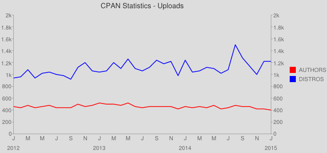
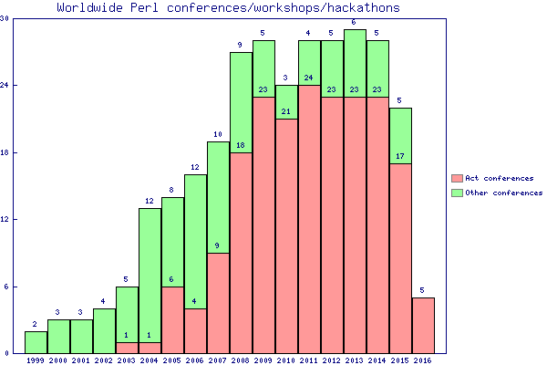
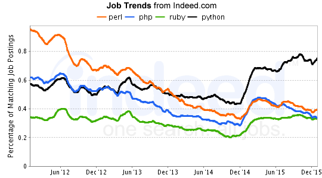
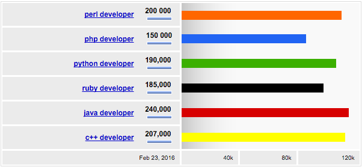
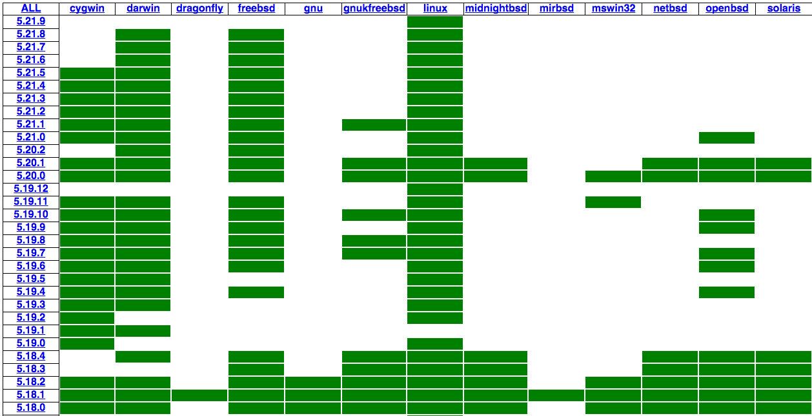

class:firstpage

# Программирование на Perl

---

# Преподаватели

.floatright[]

Владимир Перепелица

Известный разработчик асинхронно-событийных модулей и приложений на Perl.

Технический директор Облака@Mail.ru.

---

# Преподаватели

.floatright[]

Вадим Пуштаев

Разработчик проекта поиск@mail.ru.

Любит Perl как современый язык программирования.

---

# Преподаватели

.floatright[]
Николай Шуляковский

Экс ведущий разработчик проекта Почта@mail.ru

Заместитель технического директора проекта МойМир@mail.ru

---

class:note_and_mark

# Отметьтесь на портале!
 
---

# Содержание

1. .bold_font[Цель курса]
1. История создания языка Perl
1. Сравнение производительности
1. Примеры проектов
1. Документация (perldoc)
1. Настройка окружения
1. Запуск скриптов (perlrun)
1. Модуль Deparse
1. Модуль Data::Dumper
1. Модуль DDP
1. Отладка perl скриптов (perldebug)

---

# Что будем учить?

Язык perl и его область применения

Основы WEB программирования и роль perl-а в нём

Метаязык XS

Основы работы с базами данных из языка perl

---

# Как будем учиться?

12 лекционных занятий

- на каждом занятии будет домашнее задание

- проверка домашних заданий будет в конце лекционных занятий

- время на выполнение домашних заданий 1 неделя

1 хакатон

- коммандная работа над разными компонентами одного приложения

Экзамен

- защита домашних заданий по PerlXS и асинхронному программированию

- ответы на вопросы по всем предыдущим темам

---

# Как оцениваются результаты?

Максимальное количество балов, которое можно получить за этот курс - 100

За все домашние задания - 80 (10,10,8,8,7,7,7,8,7,8)

Хакатон - 20

Для получения диплома необходимо набрать 70 балов.

Двое лучших будут приглашены на собеседование, для прохождения стажировки.

---

# Содержание

1. Цель курса
1. .bold_font[История создания языка Perl]
1. Сравнение производительности
1. Примеры проектов
1. Документация (perldoc)
1. Настройка окружения
1. Запуск скриптов (perlrun)
1. Модуль Deparse
1. Модуль Data::Dumper
1. Модуль DDP
1. Отладка perl скриптов (perldebug)

---

# История создания языка Perl

.floatright[]

18 декабря 1987г. — вышла первая версия языка программирования Perl

Её создал программист Ларри Уолл (Larry Wall).

В названии этого языка кроется аббревиатура practical extraction and report language

Несложно заметить, что в аббревиатуре не хватает одной буквы «a» (PEARL).

Но в те времена уже существовал язык с таким названием, по этому Ларри сократил название почти не изменив произношения.

???

практический язык для извлечения данных и составления отчётов

---

# История создания языка Perl

Перл создавался в среде Unix, которая оказала существенное влияние на развитие языка и его популярность.

Среда Unix изначально создавалась группой программистов для самих же себя — удобное рабочее место программиста.

Принципы:
- максимально функционально
- кратко
- единообразно

---

# История создания языка Perl

Новому языку для обработки текстов было не просто

Существовали другие утилиты по обработке текста: awk, sed, grep и другие

perl полюбился огромному числу системных администраторов

Он был лёгок в изучении и применении

С его помощью действительно можно было решить большинство повседневных задач

---

# История создания языка Perl

Развитие на то время было мотивированно тем, что программисты из разных стран отправляли Ларри Уоллу предложения по модернизации языка и доработкам

---

# История создания языка Perl

Развитие на то время было мотивированно тем, что программисты из разных стран отправляли Ларри Уоллу предложения по модернизации языка и доработкам

1988 году вышла версия 2.0

---

# История создания языка Perl

Развитие на то время было мотивированно тем, что программисты из разных стран отправляли Ларри Уоллу предложения по модернизации языка и доработкам

1988 году вышла версия 2.0

1989 году вышла версия 3.0

---

# История создания языка Perl

Развитие на то время было мотивированно тем, что программисты из разных стран отправляли Ларри Уоллу предложения по модернизации языка и доработкам

1988 году вышла версия 2.0

1989 году вышла версия 3.0

1991 году вышла версия 4.0

---

# История создания языка Perl

Развитие на то время было мотивированно тем, что программисты из разных стран отправляли Ларри Уоллу предложения по модернизации языка и доработкам

1988 году вышла версия 2.0

1989 году вышла версия 3.0

1991 году вышла версия 4.0

1994 году появляется знаменитая 5 версия языка Perl

При её подготовке было многое переосмыслено, и почти полностью переписано. Он стал модульным в нем появились зачатки ООП

"Настоящее величие в том, сколько свободы вы даёте другим, а не в том, как вам удаётся заставлять других делать то, что вы хотите" - Ларри Уолл

---

# История создания языка Perl

До выхода 5 версии Ларри делал Perl для сообщества и по просьбе сообщества

А начиная с версии 5.0 он стал придерживаться позиции, что теперь этот язык должно делать сообщество само для себя и под свои нужды

---

# История создания языка Perl

До 2009 года было примерно 200 релизов новых версий языка perl

Были даже параллельные разработки разных направлений развития языка

perl 5.005 развивался отдельно и параллельно вплоть до 2009 года

Однако вышедший в 2000 году перл версии 5.6.0 с поддержкой юникода вытеснил другие версии впитав в себя все полезное из них

---

# История создания языка Perl

Утверждение языка.

perl5 с самого своего появления:

- стал активно занимать нишу разработки WEB приложений

- укреплять свои позиции среди системных администраторов

- количество однострочников, написанных системными администраторами, всего мира не поддаётся исчислению

---

# История создания языка Perl

Сложности развития программного продукта:

В 2002 году Perl  был исключён из стандартной поставки FreeBSD

В стандартной поставке FreeBSD был perl версии 5.0, хотя в портах уже жил 5.6

Но внедрение perl 5.6 пугало релиз инженеров FreeBSD, темпами роста программ и модулей для perl

Всё это повлекло к тому, что программисты и системные администраторы начали переходить на более новый perl

---

# История создания языка Perl

Однако перл продолжает развиваться

В 2003 году появляется сайт perl6.ru

"Перл 5 уже начал умирать, потому что люди воспринимали его как тупиковый язык. Странно, но когда мы объявили Перл 6, Перл 5 неожиданно обрёл второе дыхание" - Ларри Уолл

---

# История создания языка Perl

Однако перл продолжает развиваться

В 2003 году появляется сайт perl6.ru

"Перл 5 уже начал умирать, потому что люди воспринимали его как тупиковый язык. Странно, но когда мы объявили Перл 6, Перл 5 неожиданно обрёл второе дыхание" - Ларри Уолл

27 ноября 2004 года был выпущен релиз 5.8.6

Он собрал в себе практически все необходимое для:

- написания модулей
- работы с юникодом
- создания высокопроизводительных приложений

---

# История создания языка Perl

Происходит изменение акцентов развития языка

Все занялись написанием модулей

Perl развивался неспешно

Новые версии появлялись только, как тестовые

Параллельно началась разработка perl 5.10

---

# История создания языка Perl

До 2005 года perl занимал в нише web программирования лидирующее положения

Руководствуясь тем, что PHP было мало, а Java была уже перебором выбор останавливался на Perl

---

# История создания языка Perl

С 2005 года перл начал терять свои позиции в области веб разработки, особенно под давлением PHP

Проигрыш языку, который создавался именно для web-разработки, был логичным

Не было сравнимого по своим функциям IDE

Стоимость разработчика на Perl была намного выше, чем на PHP

Порог входа в PHP ниже

Некрасивые ошибки вида "Internal Server Error"

---

# История создания языка Perl

В начале 2006 года вышла версия 5.8.8

Мотивирован выпуск этой версии был улучшениями для работы с XS модулями

И еще в этот релиз вошло множество мелких исправлений

---

# История создания языка Perl

Примерно в конце 2006 года в сети Интернет стали встречаться посты «Perl умер»

О Перле стали меньше говорить, но он продолжает делать свою работу

В это же время появился Python

Хипстеры качают новый язык

Близился релиз второй версии ruby on rails

Это высказывание было простимулированно долгим созданием perl6

---

# История создания языка Perl

Однако

В 2006 году было выпущено более 3000 модулей для perl

---

# История создания языка Perl

Однако

В 2006 году было выпущено более 3000 модулей для perl

В 2007 году приблизительно 5500 модулей

---

# История создания языка Perl



.floatright[В 2010 год было:

4850 активных авторов

20335 дистрибутивов

~75000 модулей]

.div[CPAN статистика:

В 2015 году:

6700 активных авторов

31398 дистрибутивов

~108010 модулей]

---

# История создания языка Perl

По всему миру было собрано много групп Perl Mongers пытаясь противостоять вытеснению языка perl

Сейчас примерно 256 групп

8 из них в России

---

# История создания языка Perl



act - Конференции программа которых зарегистрирована и размещена на официальном сайте Moungers групп

other - Другие конференции


---

# История создания языка Perl

perl6 в истории развития языка в целом:

Сайт perl6.ru появился в 2003 году

Что то вменяемое можно было написать только к 2010 году

В 2014 году стало все гораздо лучше, но в продакшене мы его еще не увидели

---

# История создания языка Perl

perl6 в истории развития языка в целом:

Сайт perl6.ru появился в 2003 году

Что то вменяемое можно было написать только к 2010 году

В 2014 году стало все гораздо лучше, но в продакшене мы его еще не увидели

25 декабря 2015 года состоялся релиз компилятора Rakudo 2015.12

---

# История создания языка Perl

Как это не парадоксально, но perl6 сыграл очень большую роль в развитии perl5

Внедрение «современности», а именно полноценная поддержка классов была успешна реализована в perl5

Не один раз и не за один подход («Есть больше одного способа сделать это» и «Простые вещи должны оставаться простыми, а сложные — стать выполнимыми»).

---

# История создания языка Perl

На конференции O'Reilly's Money по финансовым технологиям в Нью-Йорке в 2008 году подсчитали количество упоминаний докладчиками базовых технологий.

Топ 3:

1. Перл
2. SQL
3. XML

---

# История создания языка Perl

На портале http://www.indeed.com/

.floatright[]

Количество вакансий разработчиков программного обеспечения на перл до сих пор выше 

---

# История создания языка Perl

600 000 уникальных посетителей CPAN в месяц

По грубым оценкам в мире на 1000 человек 1 программист ~6,5 миллионов программистов

1 из 10-20 пишет на Perl

---

# История создания языка Perl

Итого на сегодняшний момент мы имеем хорошо зарекомендовавший себя язык

Огромную быстро растущую библиотеку

Большое, активное сообщество

Язык Perl6 и его отличный прототип, который вносит свои коррективы в развитие perl5

А так же идею сделать perl7, который быстро попадёт в продакшин, основываясь на опыте создания perl6 и надобности perl5

Высокие зарплаты

---

# История создания языка Perl

Обзор зарплат WEB программистов



---

# Содержание

1. Цель курса
1. История создания языка Perl
1. .bold_font[Сравнение производительности]
1. Примеры проектов
1. Документация (perldoc)
1. Настройка окружения
1. Запуск скриптов (perlrun)
1. Модуль Deparse
1. Модуль Data::Dumper
1. Модуль DDP
1. Отладка perl скриптов (perldebug)

---

# Сравнение производительности

Самое слабое место - это математика.

По отношению к языку С проигрыш до 20-30 раз, иногда и больше.

По отношению к js около 2-10 раз

По отношению к python примерно примерно на 10%

По отношению к PHP примерно на 4%

Тяжёлые математические расчеты можно уносить в C + XS или lua, XS+FFI, PDL

???

Perl Data Language набор векторных расширений для языка программирования Perl 5-й версии. Предназначен для научных расчётов и иных задач, связанных с обработкой больших объёмов данных, в том числе: обработка изображений, компьютерное моделирование физических систем.

---

# Сравнение производительности

Регулярные выражения (парсеры)

Perl выигрывает в этом отношении у всех динамических языков и по скорости разработки и по производительности

По сравнению с языком C, perl выигрывает по скорости разработки и немного уступает по производительности

Написать регулярное выражение обычно намного проще чем однопоточный парсер на C

---

# Сравнение производительности

Работа с сетью

Доступность всех необходимых системных вызовов для построения низкоуровневых библиотек

Отличная производительность среди всех динамических языков

Разница с языком C не более чем в 3 раза однако скорость разработки гораздо выше

Связка сеть+регэкспы позволяет быстро писать прототипы, которые во многих случаях можно больше не ускорять за ненадобностью

---

# Содержание

1. Цель курса
1. История создания языка Perl
1. Сравнение производительности
1. .bold_font[Примеры проектов]
1. Документация (perldoc)
1. Настройка окружения
1. Запуск скриптов (perlrun)
1. Модуль Deparse
1. Модуль Data::Dumper
1. Модуль DDP
1. Отладка perl скриптов (perldebug)

---

# Примеры проектов

Сайты визитки. Такие проект на языке perl сейчас реализовываются крайне редко и это понятно.

Сегодня большая часть веб-разработки — это конструктор.

- perl занимал нишу языков для веб проектов долгое время только из-за того, что не было других альтернатив
- языки, которые создавались именно для легковесных web-проектов заняли нишу CMS
- не на всех виртуальных хостингах есть поддержка perl
- главная проблема веб-разработки на Perl заключается в том, что вы не можете скачать архив с фреймворком, распаковать, и пихать свой код в папочку src

---

# Примеры проектов

Сайты средней нагрузки и размера

Хороший фреймворк рано или поздно встанет вам поперек работы. У него есть целых два способа сделать это: быть слишком негибким, чтобы вы возопили в попытках вписаться в него, либо же быть достаточно гибким, чтобы вы взвыли от слабой связанности и размазаности алгоритмов по коду.

Perl выигрывает у других за счёт наличия большого количества инструментов для масштабирования.

---

# Примеры проектов

Монстры

Компании активно использующие Perl в инфаструктуре или имеющие сайты на нем:
- Mail.ru Group
- Yandex
- Amazon
- Booking
- New York Times
- DuckDuckGo
- DigitalOcean
- Buzzfeed
- Abills

Коробочные продукты на Perl:
- Bugzilla
- SpamAssassin
- twiki
- OTRS
- RT

---

# Содержание

1. Цель курса
1. История создания языка Perl
1. Сравнение производительности
1. Примеры проектов
1. .bold_font[Документация (perldoc)]
1. Настройка окружения
1. Запуск скриптов (perlrun)
1. Модуль Deparse
1. Модуль Data::Dumper
1. Модуль DDP
1. Отладка perl скриптов (perldebug)

---

# Документация (perldoc)

- Где можно читать про perl?

---

# Документация (perldoc)

- Где можно читать про perl?
- Откуда брать документацию?

---

# Документация (perldoc)

- Где можно читать про perl?
- Откуда брать документацию?
- Как изучать?

---

# Документация (perldoc)

- Где можно читать про perl?
- Откуда брать документацию?
- Как изучать?

Самое полное и точное собрание документации находится в perldoc-е

---

# Документация (perldoc)

Perldoc — это утилита распространяемая с дистрибутивом perl.

Она помогает:

- быстро находить необходимую информацию

- узнавать о нововведениях

- находить новые и пополнять существующие знания о правильном использовании языка и стилистике написания программ

---

# Документация (perldoc)

С чего начать?

---

# Документация (perldoc)

С чего начать?

Конечно же с запуска perldoc perl

---

# Документация (perldoc)

Тут можно найти название разделов с обучающими материалами

perlrequick, perlretut — быстрое начало работы с регулярными выражениями и полное описание работы с ними

perlboot, perltoot, perltooc, perlbot — perl и ООП или ООП в perl

perlstyle — правила стилистики написания программ

perlfaq* - часто задаваемые вопросы по перлу

---

# Документация (perldoc)

Так же можно найти и техническую документацию.

perlsyn — синтаксис языка perl.

---

layout:true

# Синтаксис языка

.footer[[perlsyn](http://perldoc.perl.org/perlsyn.html)]

---

* Программа - последовательность конструкций (statement)
* Синтаксис близок к языку C
* Perl заимствовал идеи и конструкции из С, shell, awk, sed

---

# Простые конструкции (`STMT`)

```perl
$a = 42;
say "test";
eval { ... };
do { ... };
my $var;
# Комментарий
```
---

# Простые конструкции возвращают значение

```perl
$a = 42;        # => 42
say "test";     # => 1
eval { 7 };     # => 7
do { 1; 2; 3 }; # => 3
my $var;        # => undef
```

---

# Блок

```perl
* {
statement;
statement;
...
* }
```

---

# Управляющие конструкции

* Условия: `if`, `unless`, `elsif`, `else`
* Циклы: `while`, `until`, `for`, `foreach`
* Выбор: `given`, `when`
* Безусловный переход: `goto`

---

# Условия - `if`

```perl
if     ( EXPR ) { ... }
```

--

```perl
if     ( EXPR ) { ... }
else            { ... }
```

--

```perl
if     ( EXPR ) { ... }
elsif  ( EXPR ) { ... }
```

--

```perl
if     ( EXPR ) { ... }
elsif  ( EXPR ) { ... }
else            { ... }
```

`elsif`, а не `elseif` или `else if`

---

# Условия - `unless`

```perl
unless ( EXPR ) { ... } # ≣ if ( not EXPR )
```

--

```perl
unless ( EXPR ) { ... }
else            { ... }
```
--
```perl
unless ( EXPR ) { ... }
elsif  ( EXPR ) { ... }
```
--
```perl
unless ( EXPR ) { ... }
elsif  ( EXPR ) { ... }
else            { ... }
```

---
layout:true

# Циклы - `while` / `until`

---

```perl
while ( EXPR ) { ... }
```
--
```perl
while ( EXPR ) { ... } continue { ... }
```
--
```perl
until ( EXPR ) { ... }
```
--
```perl
until ( EXPR ) { ... } continue { ... }
```

---

```perl
LABEL:
while ( EXPR ) { ... }
```
```perl
LABEL:
while ( EXPR ) { ... } continue { ... }
```
```perl
LABEL:
until ( EXPR ) { ... }
```
```perl
LABEL:
until ( EXPR ) { ... } continue { ... }
```
--
```perl
LABEL: { ... } continue { ... }
```

---

layout:false
# Циклы - `for` / `foreach`

---
layout:false
class:center, middle

.center[
# `for` ≡ `foreach`
]

---

layout:true
# Циклы - `for` / `foreach`


---

```perl
for ( EXPR; EXPR; EXPR ) { ... }
```

```perl
for ( LIST ) { ... }
```

```perl
for VAR ( LIST ) { ... }
```

```perl
for ( LIST ) { ... } continue { ... }
```

```perl
for VAR ( LIST ) { ... } continue { ... }
```

---

```perl
LABEL:
for ( EXPR; EXPR; EXPR ) { ... }
```

```perl
LABEL:
for VAR ( LIST ) { ... }
```

```perl
LABEL:
for VAR ( LIST ) { ... } continue { ... }
```

---

layout:true
# Документация (perldoc)

---

Так же можно найти и техническую документацию.

perlsyn — синтаксис языка perl.

perldata — типы данных используемых в перле. Типы данных? В перле есть типы данных?

---

layout:true
# Переменные - типы

---

* SCALAR
* ARRAY
* HASH

---

* SCALAR
- Number
- String
- Reference
* ARRAY
- Of scalars
* HASH
- Key: string
- Value: scalar

---

* SCALAR (`$s`)
- Number (`$s = 1`, `$s = -1e30`)
- String (`$s = "str"`)
- Reference
+ Scalar (`$$r`, `${ $r }`)
+ Array (`@$r`, `@{ $r }`, `$r->[...]`)
+ Hash (`%$r`, `%{ $r }`, `$r->{...}`)
+ Function (`&$r`, `&{$r}`, `$r->(...)`)
+ Filehandle (`*$r`)
+ Lvalue (`$$r`, `${ $r }`)
+ Reference (`$$r`, `${ $r }`)
* ARRAY (`@a`, `$a[...]`)
* HASH (`%h`, `$h{key}`, `$h{...}`)


???
;

---

layout:true
# Документация (perldoc)

Так же можно найти и техническую документацию.

perlsyn — синтаксис языка perl.

perldata — типы данных используемых в перле. Типы данных? В перле есть типы данных? Да там есть 3 типа данных «Скаляр» $var, «Массив» @var, «Ассоциативный массив» (хэш) %var.

perlvar - специальные переменные

---

layout:true

# Специальные переменные

.footer[[perlvar](http://perldoc.perl.org/perlvar.html)]

---

* `$_` `$ARG` - аргумент по умолчанию
* `@_` `@ARG` - аргументы функции
* `$a` `$b` - переменные, используемые при сортировке
* `%ENV` - переменные окружения
* `@ARGV` - аргументы программы

```perl
for (sort { $a <=> $b } @ARGV) {
say "Arg: $_";
}
say "Was run by $ENV{USER}";
```

---

* `$"` `$LIST_SEPARATOR` - разделитель<code><br></code> при интерполяции в кавычках
* `$,` `$OUTPUT_FIELD_SEPARATOR` - разделитель между элементами списка при выводе
* `$/` `$INPUT_RECORD_SEPARATOR` - разделитель входного потока для readline
* `$\` `$OUTPUT_RECORD_SEPARATOR` - разделитель выходного потока для print
* `$.` $INPUT_LINE_NUMBER

---

```perl
$" = "."; # $LIST_SEPARATOR
$, = ";"; # $OUTPUT_FIELD_SEPARATOR
$\ = "\n\n"; # $OUTPUT_RECORD_SEPARATOR
while (<>) {
chomp;
@a = split /\s+/, $_;
say "$. @a",@a;
}
```

---

* `$!` `$ERRNO`
* `$<` `$UID`
* `$$` `$PID`
* `$0` `$PROGRAM_NAME`
* `$^X` `$EXECUTABLE_NAME`
* `$^O` `$OSNAME`
* `$^V` `$PERL_VERSION`

???
>
---
```perl
say "I'm $^X, $^V, on $^O";
say "Script: $0 (@ARGV);";
say "Pid $$ by uid $<";
open my $f, '<','/etc/shadow'
or die "No shadow: $!\n";
```

```bash
/usr/bin/perl sample.pl -test
```

```perl
# I'm /usr/bin/perl, v5.18.2, on darwin
# Script: sample.pl (-test);
# Pid 70032 by uid 502
# No shadow: No such file or directory
```

???
">

---

layout:true
# Документация (perldoc)

---

Так же можно найти и техническую документацию.

perlsyn — синтаксис языка perl.

perldata — типы данных используемых в перле. Типы данных? В перле есть типы данных? Да там есть 3 типа данных «Скаляр» $var, «Массив» @var, «Ассоциативный массив» (хэш) %var.

perlvar - специальные переменные

perlop — операции которые поддерживает перл с ранее описанными типами данных. Это довольно большая документация к которой скорее всего вам придётся обращаться не один раз. Заострю ваше внимание на такой вещи, как quote-like operatores. Обычно в этот раздел приходят либо найдя в чужом коде непонятные qr// qw// конструкции, либо, что еще хуже, когда обнаруживаются проблемы в безопасности вашего приложения работающего в продакшене.

perlsub - всё что касается объявления и использования подпрограмм.

perlfunc - описание встроенных функций

perlpod* - документирование кода

perlmod* - модульность в перле

perlxs*, perlembed, perlcall - интеграция языка perl и C

---

Это набор наверно основных точек документации с которыми вам придётся сталкиваться на протяжении первых лекций и при выполнении домашних заданий.

Но это далеко не все разделы документации которые есть в perldoc

На протяжении всего курса мы будем указывать ссылки на документацию

Так же документацию можно смотреть на http://perldoc.perl.org

---
layout: false
# Содержание

1. Цель курса
1. История создания языка Perl
1. Сравнение производительности
1. Примеры проектов
1. Документация (perldoc)
1. .bold_font[Настройка окружения]
1. Запуск скриптов (perlrun)
1. Модуль Deparse
1. Модуль Data::Dumper
1. Модуль DDP
1. Отладка perl скриптов (perldebug)

---

# Настройка окружения

perl завоевал к себе доверие, за счет того, что был портирован под всевозможные платформы и системы



---

# Настройка окружения

MacOSx сам перл уже предустановлен

А вот для сборки XS-модулей, вам придётся установить себе xcode + “Command line tools”

Подробнее про установку можно прочитать в perldoc perlmacosx

Так же возможно вам может понадобится macports

---

# Настройка окружения

Linux.

Как правило дистрибутив языка перл есть в репозитории системы портов.

Например:

- для CentOS установка выполняется посредством вызова yum install perl
- для Debian: apt-get install perl
- для GenToo: emerge dev-lang/perl
- для FreeBSD: pkg add perl

Для любителей компилировать свё под свою систему:
- make perl ./Configure -des; make test instal

---

# Настройка окружения

Windows.

Тут выбор велик, я отмечу самые популярные из вариантов:

- ActivePerl от ActiveState
- StrawberryPerl
- cygwin

Мы рекомендуем использовать StrawberryPerl

В отличие от ActivePerl он идёт сразу с компилятором mingw и установка модулей в нём становится гораздо удобнее и проще

С ActivePerl надо позаботится о наличие nmake + win32GnuUtils иначе сборка модулей будет для вас мучительной и утомляющей

---

# Настройка окружения

После установки проверяем доступность интерпретатора: perl -v

Выдача будет примерно такой

```bash
This is perl 5, version 18, subversion 2 (v5.18.2) built for 
x86_64-linux-gnu-thread-multi
(with 40 registered patches, see perl -V for more detail)

Copyright 1987-2013, Larry Wall

Perl may be copied only under the terms of either the Artistic License or the
GNU General Public License, which may be found in the Perl 5 source kit.

Complete documentation for Perl, including FAQ lists, should be found on
this system using "man perl" or "perldoc perl".  If you have access to the
Internet, point your browser at http://www.perl.org/, the Perl Home Page.
```

---

# Настройка окружения

Если вы видите, что то в виде «Command not found». Или другие ошибки, то с установкой, что то пошло не так.

Возможно интерпретатор находится за пределами все возможных путей из переменной окружения среды PATH

---

# Содержание

1. Цель курса
1. История создания языка Perl
1. Сравнение производительности
1. Примеры проектов
1. Документация (perldoc)
1. Настройка окружения
1. .bold_font[Запуск скриптов (perlrun)]
1. Модуль Deparse
1. Модуль Data::Dumper
1. Модуль DDP
1. Отладка perl скриптов (perldebug)

---

# Запуск скриптов (perlrun)

Разберёмся с запуском и выполнением простейших однострочных скриптов.

Именно с этого и пошло развитие этого языка

Самое приятное — это то, что perl под всеми системами работает одинаково, за исключением системнозависимых библиотек.

---

# Запуск скриптов (perlrun)

Немного синтаксиса, для упрощения понимания следующих слайдов

Магический модуль в начале каждого скрипта use strict;

Объявление переменных при помощи конструкции my $var;

Объявление масива и хеша @var, %var. Обращение к элементам $var[0] и $var{key}

Ссылки это всегда скаляры $array = []; $hash = {};

---

# Запуск скриптов (perlrun)

Ключ -e сообщает интерпретатору, что следующую за ключом строку надо выполнить, как скрипт:

```bash
perl -e 'print "Hello world\n"'
```

Однако будьте аккуратны с кавычками, не все шеллы одинаково с ними работают.

---

# Запуск скриптов (perlrun)

Обычно однострочная программа, обрабатывает данные приходящие ей в стандартном вводе.

Вот простейшая программа которая читает стандартный ввод и распечатывает строки добавляя в начало каждой из них дефис

```bash
perl -e 'while(<>){print "- ".$_}'
```

---

# Запуск скриптов (perlrun)

Обычно однострочная программа, обрабатывает данные приходящие ей в стандартном вводе.

Вот простейшая программа которая читает стандартный ввод и распечатывает строки добавляя в начало каждой из них дефис

```bash
perl -e 'while(<>){print "- ".$_}'
```

Но кто захочет писать каждый раз такую конструкцию?

```perl
while(<>){}
```

---

# Запуск скриптов (perlrun)

Обычно однострочная программа, обрабатывает данные приходящие ей в стандартном вводе.

Вот простейшая программа которая читает стандартный ввод и распечатывает строки добавляя в начало каждой из них дефис

```bash
perl -e 'while(<>){print "- ".$_}'
```

Но кто захочет писать каждый раз такую конст рукцию?

```perl
while(<>){}
```

Для упрощения написания таких однострочников был придуман ключ -n

```bash
perl -ne 'print "- ".$_'
```

---

# Запуск скриптов (perlrun)

Внутри вот такого цикла:

```perl
while(<>){}
```

Переменная $_ будет содержать цельную строку вместе с символом \n

Что бы не использовать команду chomp (отрезающую в конце перенос строки) можно использовать флаг -l :

- устанавливает переменную $\ (разделитель, который выведен после каждого выполнения команды print)
- устанавливает переменную $/ (разделитель по которому будет делится входящий поток, отдельно его можно выставить с помощью флага -0)
- удаляет из строки $_ последний перенос строки (при совместном использовании с флагом -n)

---

# Запуск скриптов (perlrun)

Например, вам нужно прочитать файл в котором записи разделены через ";" и вывести каждую запись на новой строке:

```bash
perl -nl00120073 -e 'print $_'
```

Или на оборот, все строки из файла записать через ";":

```bash
perl -nl00730012 -e 'print $_'
```

---

# Запуск скриптов (perlrun)

Флаг -p делает тоже самое, что и флаг -n, только в каждую итерацию цикла добавит еще вывод переменной $_

Таким образом прошлый пример можно преобразовать:

```bash
perl -pl00730012 -e ''
```

```bash
perl -pl00730012 -e ''
```

Очень похоже на язык который сам за нас пишет программы )))

Детальнее можно посмотреть тут: perldoc perlvar

---

# Запуск скриптов (perlrun)

Для парсинга более сложных структур файлов, например когда в каждой строке есть записи разделенные определённым разделителем, можно использовать флаг -a совместно с -F

-a добавляет функцию разделяющую входную строку на части и складывает в спецмассив @F

-F устанавливает разделитель, по умолчанию это пробел

Например вам надо прочитать файл-таблицу, в которой каждая строка представляет собой набор полей разделенных ";", проверить третью колонку на наличие там 1 и при выполнении условия вывести значение из 2 колонки

```perl
perl -lnaF';' -e 'if( $F[2] == 1 ){ print $F[1] };'
```

!О переводах строк за нас побеспокоился флаг -l

---

# Запуск скриптов (perlrun)

Если ваша программа требует подключения модулей, то подключить модули можно опцией -M, например:

```perl
perl -MJSON::XS -e 'print JSON::XS::encode_json({var1 => 1, var2 => 2})'
```

---

# Запуск скриптов (perlrun)

Это не все ключи которые поддерживает перл, но их должно хватить, для начала изучения.

А теперь немного вернёмся к истории. Я уже говорил о том, что perl 5 версии был переосмыслен и почти полностью переписан. Так вот начиная с версии 5.005 был сделан доступ к компилятору.

Теперь мы можем заглянуть во внутренности компилятора perl. Посмотреть как будет выглядеть ваш код, посмотреть на информацию компиляции.

---

# Запуск скриптов (perlrun)

Для таких модулей был выделен неймспейс B::

А доступ к компирятору реализован в модуле "O"

```bash
perl -MO=Backend
```

Вот такой нехитрой записью можно определить модуль которому будет передана ваша программа после компиляции.

---

# Содержание

1. Цель курса
1. История создания языка Perl
1. Сравнение производительности
1. Примеры проектов
1. Документация (perldoc)
1. Настройка окружения
1. Запуск скриптов (perlrun)
1. .bold_font[Модуль Deparse]
1. Модуль Data::Dumper
1. Модуль DDP
1. Отладка perl скриптов (perldebug)

---

# Модуль Deparse

B::Deparse - очень полезный модуль, который способен превратить опкоды вышедшие после компилятора в пелркод.

Другими словами декомпилировать opcode обратно в perl

B::Concise - бекенд позволяющий посмотреть опкоды как они есть

Возьмём уже известный нам пример:

```bash
perl -pl00730012 -e ''
```

И попробуем воспользоватся модулем O передав ему параметром модуль B::Deparse

```bash
perl -MO=Deparse -pl00730012 -e ''
```

---

# Модуль Deparse

На выходе получим

```perl
BEGIN { $/ = "\n"; $\ = ";"; }
LINE: while (defined($_ = <argv>) ){
chomp $_;
}
continue {
die "-p destination: $!\n" unless print $_;
}
-e syntax OK
```

</argv>

---

# Модуль Deparse

У модуля B::Deparse есть свои удобные ключи

- -l добавит комментарии с ссылками на строки исходного файла
- -p расставит скобки и тем самым покажет приоритетность выполнения команд
- -q развернёт интерполируемые строки (строки заключенные в двойные кавычки)

---

# Модуль Deparse

У модуля B::Deparse есть свои удобные ключи

- -l добавит комментарии с ссылками на строки исходного файла
- -p расставит скобки и тем самым покажет приоритетность выполнения команд
- -q развернёт интерполируемые строки (строки заключенные в двойные кавычки)

"Hello $name" = 'Hello ' . $name != 'Hello $name'

---

# Модуль Deparse

У модуля B::Deparse есть свои удобные ключи

- -l добавит комментарии с ссылками на строки исходного файла
- -p расставит скобки и тем самым покажет приоритетность выполнения команд
- -q развернёт интерполируемые строки (строки заключенные в двойные кавычки) "Hello $name" = 'Hello ' . $name != 'Hello $name'
- -s определяет стиль вывода кода
- -sC не ставит переносы строк перед блоками else elsif и continue
- -siNUMBER определит кол-во пробелов в отступе
- -siT вместо каждых 8 пробелов будет использовать табуляцию
- -xNUMBER уровень развертывания кода

---

# Модуль Deparse

B::Deparse можно использовать, как обычный модуль

Если вам необходимо посмотреть на код функции по ссылке на эту функцию

```perl
use B::Deparse;
sub func {
print 'Hello world!!!'
};

my $deparse = B::Deparse->new("-p", "-sC");
$body = $deparse->coderef2text(\&func);

print $body;
```

Выполнив такую программу на стандартный вывод мы получим:

```perl
{
print('Hello world!!!');
}
```

---

# Модуль Deparse

При уровне дебага большем чем 3 все циклы for будут развёрнуты в while

```bash
perl -MO=Deparse,x3 -e 'for ($i = 0; $i < 10; ++$i) {print $i;}'
```

Привратится в
```perl
$i = 0;
while ($i < 10) {
print $i;
} continue {
++$i
}
```
???
'></10>
---

# Промежуточные итоги

Итого на данном этапе вы уже знаете

- как установить perl
- где искать документацию
- как запускать простейшие однострочники
- как изучать поведение компилятора с вашими однострочниками

Далее мы перейдём к модулю который помогает разворачивать сложные структуры данных

---

# Содержание

1. Цель курса
1. История создания языка Perl
1. Сравнение производительности
1. Примеры проектов
1. Документация (perldoc)
1. Настройка окружения
1. Запуск скриптов (perlrun)
1. Модуль Deparse
1. .bold_font[Модуль Data::Dumper]
1. Модуль DDP
1. Отладка perl скриптов (perldebug)

---

# Модуль Data::Dumper

Data::Dumper - модуль, который поможет выводить на экран в развернутом виде сложные структуры данных.

```perl
use Data::Dumper;
my $foo = [{a => 1, b => 2},{c => 3, d => 4}];
print Dumper($foo);
```

Вот так красиво демонстрирует эту переменную Data::Dumper

```perl
$VAR1 = [
{
'b' => 2,
'a' => 1
},
{
'c' => 3,
'd' => 4
}
];
```

---

# Содержание

1. Цель курса
1. История создания языка Perl
1. Сравнение производительности
1. Примеры проектов
1. Документация (perldoc)
1. Настройка окружения
1. Запуск скриптов (perlrun)
1. Модуль Deparse
1. Модуль Data::Dumper
1. .bold_font[Модуль DDP]
1. Отладка perl скриптов (perldebug)

---

# Модуль DDP (Data::Printer)

Есть альтернативный модуль для просмотра структур и объектов. Его обычно используют для дебага приложений.

У этого модуля не меньше настроек, чем у Data::Dumper, но его проще использовать, например:

```perl
use DDP;
my $foo = {a=>1, b=> 2, c=> [1,2,3]};
p $foo;

```

На выходе:

```perl
\ {
a   1,
b   2,
c   [
[0] 1,
[1] 2,
[2] 3
]
}
```

---

# Модуль DDP (Data::Printer)

Некоторые отличия от Data::Dumper

Автор этого модуля позаботился о цветовой разметке выводимых данных, для удобства чтения.

Так же у этого модуля более расширенный дамп объектов, но нет сериализации

```perl
\ SomeClass  {
Parents       Moose::Object
Linear @ISA   SomeClass, Moose::Object
public methods (3) : bar, foo, meta
private methods (0)
internals: {
_something => 42,
}
}
```

---

# Содержание

1. Цель курса
1. История создания языка Perl
1. Сравнение производительности
1. Примеры проектов
1. Документация (perldoc)
1. Настройка окружения
1. Запуск скриптов (perlrun)
1. Модуль Deparse
1. Модуль Data::Dumper
1. Модуль DDP
1. .bold_font[Отладка perl скриптов (perldebug)]

---

# Отладка perl скриптов (perldebug)

Для начала работы с дебагером рекомендую прочитать документацию perldebtut

Запуск отладчика выполняется добавлением ключа -d при запуске интерпретатора

perl -d myscript.pl

Для того, что бы отладчик запустился скрипт не должен содержать синтаксических ошибок и должен нормально компилироваться perl -c

---

# Отладка perl скриптов (perldebug)

После запуска отладчика вы увидите на экране

```bash
Loading DB routines from perl5db.pl version 1.44
Editor support available.

Enter h or 'h h' for help, or 'perldoc perldebug' for more help.

DB<1>
```
#
</1>

Далее отладчик ждёт от вас команд

---

# Отладка perl скриптов (perldebug)

Отладка программ подразумевает построчное их выполнение с возможностью просмотра состояния переменных между ними.

Одним из вариантов отладки является вывод в STDERR состояние переменных в том или ином месте кода.

Каждый из вариантов является по своему удобный.

---

# Отладка perl скриптов (perldebug)

Некоторые команды отладчика для просмотра кода и значения переменных

- l посмотреть код. Параметра можно указать номер строки, номер строки + интервал, диапазон строк, название функции. На выход вы получаете запрошенный код
- - посмотреть предыдущий код относительно текущей строки
- v посмотреть код вокруг указанной строки
- / поиск по коду в прямом направлении на вход эта команда принимает регулярное выражение, если ничего не передавать то отладчик продолжит поиск по предыдущему запросу
- ? поиск по коду в обратном направлении
- f загрузка файла для просмотра, на вход принимает имя файла
- . вернуть указатель на текущую позицию выполнения кода
- m $obj показать все методы объекта
- M показать список всех загруженных модулей
- S список всех доступных функций в данной точке
- [X|V] [Package] [str|~re] список переменных. Можно передать имя пакета внутри которого интересуют переменные, название переменно или регулярное выражение для названия переменной

---

# Отладка perl скриптов (perldebug)

Команды отладчика для выполнения кода
- p выполнить перл выражение и показать результат
- n шаг вперёд без захода в процедуру
- s шаг вперёд с заходом в процедуру
- T стек вызовов в данной точке
- ! повторить предыдущую команду. На вход можно передать номер команды в истории которую надо повторить
- source file - выполнить команды из файла
- с продолжить выполнение программы. Если параметром указать номер строки или имя функции, то отладчик продолжит выполнение до указанного места
- r продолжить выполнение скрипта до выхода из подпрограммы
- q выход из отладчика


---

# Отладка perl скриптов (perldebug)

Точки останова, действия, точки наблюдения

- b < line|sub > [условие] - установить точку останова на указанную строку или функцию при выполнении условия
- B < ln|* > - снять точку останова
- a строка действие [условие] - установить действие которое сработает достигнув определённой строки
- A < line|* > - удалить действие
- w $var - установить наблюдение за переменной
- W $var|* - снять наблюдение за переменной
- L [a|b|w] - вывести список точек останова, действий, наблюдений за переменными
- R - начать скрипт заново оставив все точки останова, действия, наблюдения

---

# Отладка perl скриптов (perldebug)

Как это выглядит. Скрипт:

```prel
use strict;

my $ret = 0;

foreach(my $i = 0; $i < 50; $i++){
if($ret>$i){
$ret -= $i;
}
else {
$ret += $i;
}
}
print $ret;
```

---

# Отладка perl скриптов (perldebug)

Запускаем

```bash
perl -d mydebug.pl
```
Отладчик запустился и выдал приглашение

```bash
Loading DB routines from perl5db.pl version 1.44
Editor support available.

Enter h or 'h h' for help, or 'perldoc perldebug' for more help.

main::(mydebug.pl:3):   my $ret = 0;

DB< 1 >
```

---

# Отладка perl скриптов (perldebug)

Просмотр кода с текущей позиции командой l

```perl
3==>    my $ret = 0;
4:      my $cnt_add = 0;
5:      my $cnt_sub = 0;
6
7:      foreach(my $i = 0; $i < 50; $i++){
8:              if($ret>$i){
9:                      $ret -= $i;
10              }
11              else {
12:                     $ret += $i;
```

Установим точку останова на 8 строку при достижении 10 итерации цикла:

```
b 8 $i == 9
```

Запустим программу

```
c
```

---

# Отладка perl скриптов (perldebug)

Когда выполнится условие $i == 9 сработает точка останова и на экране появится сообщение

```
DB< 7 >
c
main::(mydebug.pl:8):           if($ret > $i){
```

Выведем значение переменной $i

```
DB< 7 > print $i
9
```

А так же поставим отслеживаться переменную $ret:

```
w $ret
```

---

# Отладка perl скриптов (perldebug)

Выполним следующую строку скрипта:

```
DB< 9 >
n
Watchpoint 0:   $ret changed:
old value:  ''
new value:  '16'
main::(mydebug.pl:9):                   $ret -= $i;

DB< 9 >
```

Дальнейшая отладка происходит по тем же принципам

---

# Домашнее задание

1. Написать однострочную программу на perl, которая на вход получает список файлов выводимых командой ls -l или dir и распечатывает на экран имена тех файлов размер которых больше 1 мегабайта. Последней строкой должна быть выведена информация по общему количеству файлов и количеству файлов размер которых больше 1 мегабайта.
2. Написать однострочную программу, которая прочитает со стандартного входа файл в виде таблицы, где поля разделены двоеточием ":". И выведет на экран номера строк и столбцов значение ячеек, которых больше 10.
3. Написать программу которая возьмёт файл из задания 2 и построит структуру данных в виде массива массивов, после чего распечатает его при помощи модулей DDP и Data::Dumper
4. Провести отладку скрипта написанного в задании 3. Создать файл сценарий для отладчика.

---

class:lastpage

# Оставьте отзыв

Спасибо за внимание!

Николай Шуляковский

Email & Agent: n.shulyakovskiy@corp.mail.ru
